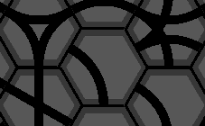
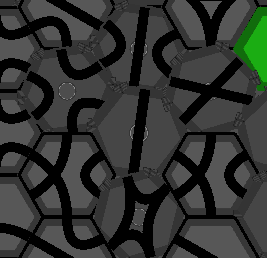
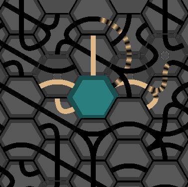
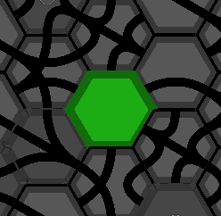

# Introduction

This is a game where the player rotates geometrical shapes to make liquids move and go to the endpoint.
Currently, this game is a beta, so there is no level for now.

# Tile Types

## Pipe tile

This is the most basic tile, containing pipes that can be filled with liquid. You can rotate it to the right / left by clicking it with the mouse (left / right click).

## Geared pipe tile

This tile is similar to the classic pipe tile, except that when this tile is clicked, all adjacent geared pipe tiles will move at the same time.

## Flow source

This tile dispenses a liquid when left-clicked with the mouse.
It is generated with one specific liquid color that it will display during all the level.

## Flow endpoint

This tile will be the condition of victory for a level. When a liquid reaches it with a pipe, it is absorbed. To goal is to reach it.

There is no interaction the player can trigger with this tile.